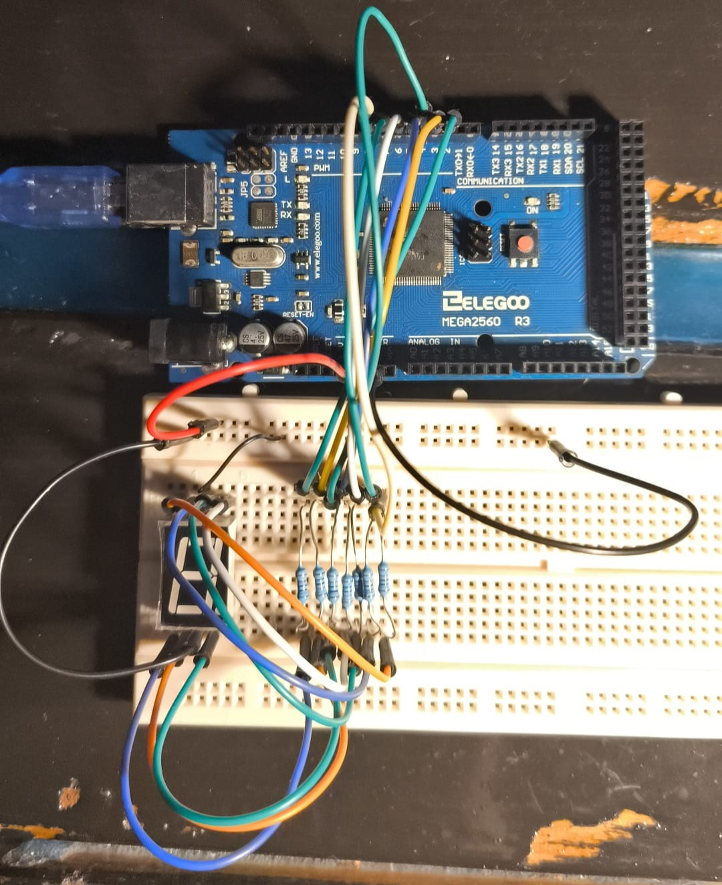

# ⚙️ 7-Segmentu Pantaila: Teoria eta Praktika | Jesuitak Indautxu

  

Proiektu honek **7-segmentuko pantailen** munduan murgiltzen gaituzte. Teoria osoa, erresistentzien kalkulua eta Arduino bidezko kontrol praktikoa biltzen ditu. Gure katu mekanikoak gainbegiratuta!

## 🧭 Proiektuaren Atalak
1.  [**7-Segmentuen Historia eta Garrantzia**](7seg_teoria_eta_kalkuluak.md#1-zazpi-segmentuen-garrantzia-elektronikaren-historian)
2.  [**Teoria eta Funtzionamendua**](7seg_teoria_eta_kalkuluak.md#2-teoria-eta-funtzionamendua)
3.  [**Erresistentzien Kalkulua (Ohm-en Legea)**](7seg_teoria_eta_kalkuluak.md#3-erresistentzien-kalkulua-ohm-en-legea)
4.  [**Hardware Konexioa**](#hardware-konexioa)
5.  [**Arduino Kodearen Azalpena**](7_seg_kodearen_azalpena.md)

## 🔩 Beharrezko Materiala
* **Arduino Mega** ⚙️
* **7-Segmentuko pantaila** (Katodo komuna)
* **7x 330Ω Erresistentzia**
* **Breadboard eta kableak** 🔌

## 🔌 Hardware Konexioa
Konexioak honela egin ditugu gure kodean:
* **a** -> Pin 6 | **b** -> Pin 5 | **c** -> Pin 4 | **d** -> Pin 3
* **e** -> Pin 2 | **f** -> Pin 7 | **g** -> Pin 8
* **Katodo Komuna** -> **GND**

Hemen ikus dezakezue gure katu mekanikoak gainbegiratutako konexioa:

  

---

  <i>2025/2026 Ikasturtea - Indautxuko Ingranajeak martxan!</i>

